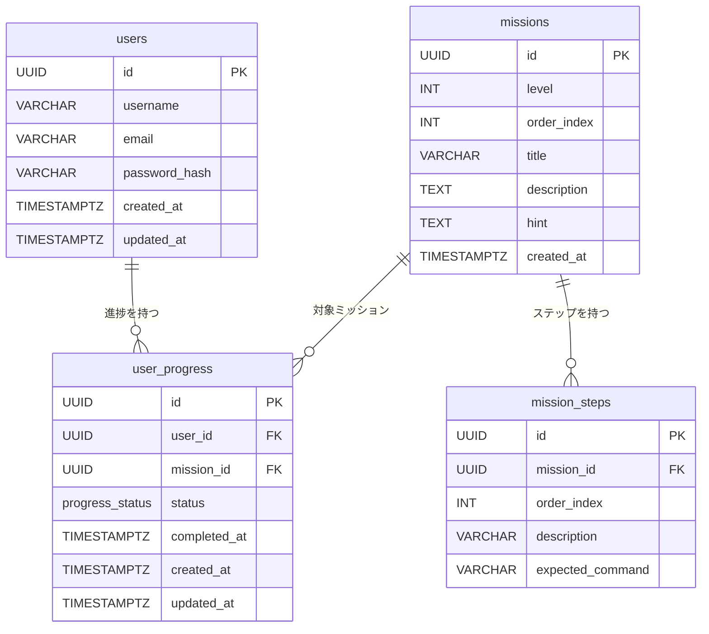

# DB 設計

## ER 図

## テーブル定義

### users — ユーザー情報

| カラム | 型 | 説明 |
|--------|-----|------|
| id | UUID | 主キー |
| username | VARCHAR(50) | ユーザー名（一意） |
| email | VARCHAR(255) | メールアドレス（一意） |
| password_hash | VARCHAR(255) | bcrypt ハッシュ |

### missions — ミッション定義

| カラム | 型 | 説明 |
|--------|-----|------|
| id | UUID | 主キー |
| level | INT | レベル番号（1〜5） |
| order_index | INT | レベル内の順番 |
| title | VARCHAR | ミッションタイトル |
| description | TEXT | ミッションの説明 |
| hint | TEXT | ヒント（任意） |

### mission_steps — ミッションのステップ

| カラム | 型 | 説明 |
|--------|-----|------|
| id | UUID | 主キー |
| mission_id | UUID | missions FK |
| order_index | INT | ステップの順番 |
| description | VARCHAR | 「git init を実行してください」 |
| expected_command | VARCHAR | 正解コマンドパターン |

### user_progress — ユーザーの進捗

| カラム | 型 | 説明 |
|--------|-----|------|
| id | UUID | 主キー |
| user_id | UUID | users FK |
| mission_id | UUID | missions FK |
| status | ENUM | NOT_STARTED / IN_PROGRESS / COMPLETED |
| completed_at | TIMESTAMPTZ | 完了日時 |

## Flyway マイグレーション

| ファイル | 内容 |
|---------|------|
| V1__create_users.sql | users テーブル |
| V2__create_missions.sql | missions / mission_steps テーブル |
| V3__create_user_progress.sql | user_progress テーブル |
| V4__insert_missions.sql | Lv.1〜3 のミッションデータ投入 |
